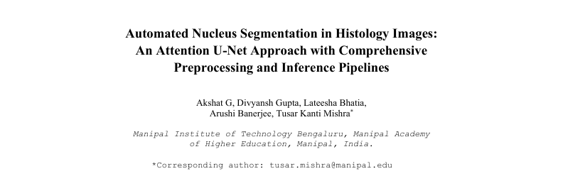

# Automated Nucleus Segmentation in Histology Images

## Overview
This repository contains the code and research documentation for the automated segmentation of cell nuclei in digital pathology. High nuclear density and staining heterogeneity in histology images pose significant challenges for quantitative analysis. This project overcomes these challenges by implementing a lightweight Attention U-Net model on the MoNuSeg 2018 dataset, combining comprehensive image preprocessing with a high-fidelity overlapping patch-stitching strategy for full-resolution inference.

## Research & Documentation

> **Abstract:** In the area of digital pathology, nucleus segmentation is an essential step for quantitative analysis; however, high nuclear density and staining heterogeneity in histology images pose a great challenge. This study implements a lightweight Attention U-Net model on the MoNuSeg 2018 dataset to overcome these challenges. The proposed pipeline ties the comprehensive image and mask preprocessing-including stain deconvolution and multi-pass mask smoothing with a high-fidelity overlapping patch-stitching strategy at the inference stage on high resolution images. The model achieved Intersection over Union (IoU) score of 0.8745 on full resolution, unseen test images. This result confirms the effectiveness of using attention mechanisms to enhance feature localization and verifies the robust stitching methodology for generating seamless and accurate segmentation maps.

## Methodology & Architecture

* **Task:** Semantic Nucleus Segmentation
* **Architecture:** Lightweight Attention U-Net (~2M parameters) incorporating attention gates on skip connections to selectively emphasize salient features.
* **Loss Function:** Custom weighted combined loss (Binary Cross-Entropy + Dice Loss) to address extreme class imbalance.

### Preprocessing Pipeline
* **Stain Deconvolution:** Isolation of the Hematoxylin channel to accentuate nuclear structures.
* **Image Enhancement:** Application of Median Filtering, Contrast Limited Adaptive Histogram Equalization (CLAHE), and Unsharp Masking.
* **Mask Refinement:** Spatial upsampling to 1000x1000 pixels, followed by multi-pass Gaussian blur and binary thresholding for smooth contour generation.

## Inference & Stitching Strategy
To handle high-resolution 1000x1000 pixel test images and preserve spatial relationships, the inference pipeline systematically divides images into a grid of overlapping 256x256 patches. Each patch is processed independently by the model, and the predictions are reconstructed using a weighted averaging scheme across overlapping regions to produce seamless segmentation maps without edge artifacts.

## Evaluation & Metrics
The model was evaluated on the MoNuSeg 2018 test set. The primary evaluation metric was the Intersection over Union (IoU), calculated as:

$$IoU = \frac{|A \cap B|}{|A \cup B|} = \frac{TP}{TP+FP+FN}$$

* **Dice Coefficient:** 0.9323
* **Intersection over Union (IoU):** 0.8745
* **Accuracy:** 0.9721
* **Precision:** 0.9067
* **AUC:** 0.9936
